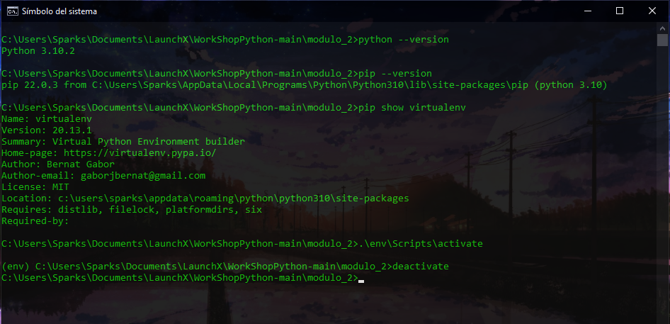

# Crear y administrar proyectos



# Comandos Utilizados
### Verifica la version de Python
```
python --version
```
### Verifica la version de Pip
```
pip --version
```
### Verifica la version de VirtualEnv
```
pip show virtualenv
```
### Ingresa a la carpeta para crear el entorno virtual
```
cd C:\Users\Sparks\Documents\LaunchX\WorkShopPython-main\modulo_2
```
### Crea un entorno virtual
```
.\env\Scripts\activate
```
### Sale del entorno virtual
```
deactivate
```
---
Curso Propedútico de Python para Launch X - Innovacción Virtual.

Material desarrollado con base en los contenidos de MSLearn y la metáfora de LaunchX, traducción e implementación por: Fernanda Ochoa - Learning Producer de LaunchX.

Este materia fue desrrollado en base en los contenidos de Onboarding Launch X BET por: Edward Sparks.

Redes:
* GitHub: [FernandaOchoa](https://github.com/FernandaOchoa)
* Twitter: [@imonsh](https://twitter.com/imonsh)
* Instagram: [fherz8a](https://www.instagram.com/fherz8a/)
* Github: [EdwardSparks](https://github.com/EdwardSparks)