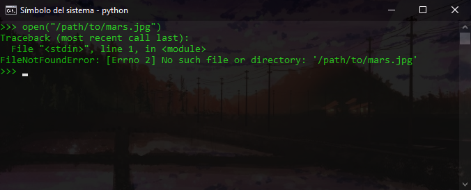
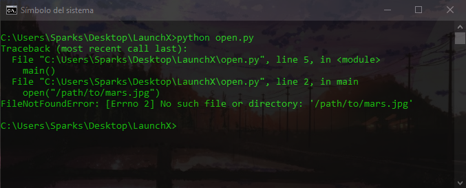
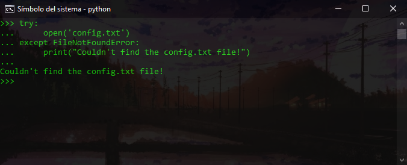
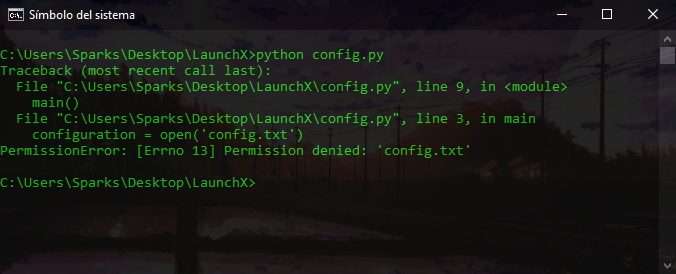
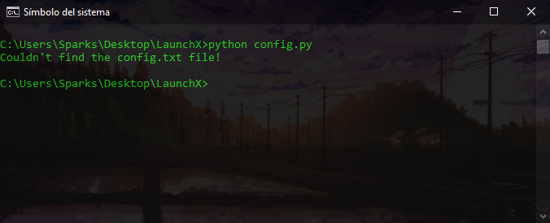
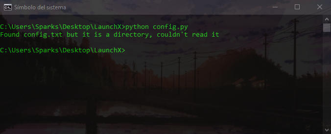
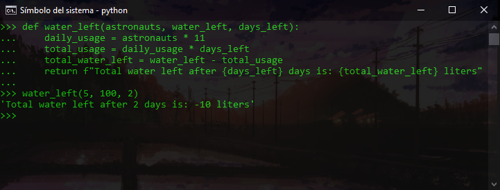
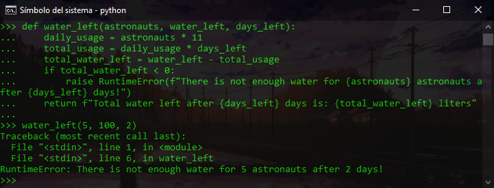
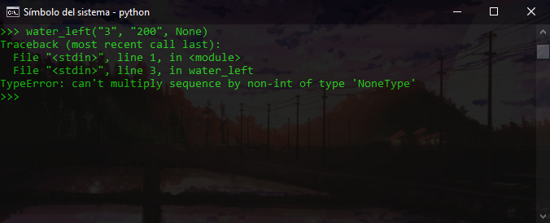
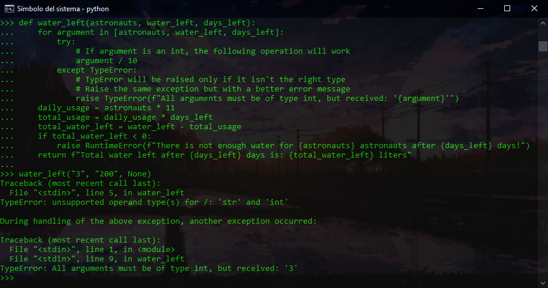

# Manejo de errores
## Uso de tracebacks para buscar errores


Ejecuto el comando que muestra un error:
```
>>> open("/path/to/mars.jpg")
Traceback (most recent call last):
  File "<stdin>", line 1, in <module>
FileNotFoundError: [Errno 2] No such file or directory: '/path/to/mars.jpg'
```




Ejecúto Python para comprobar el siguiente mensaje de error:
```
$ python3 open.py
Traceback (most recent call last):
  File "/tmp/open.py", line 5, in <module>
    main()
  File "/tmp/open.py", line 2, in main
    open("/path/to/mars.jpg")
FileNotFoundError: [Errno 2] No such file or directory: '/path/to/mars.jpg'
```

---

## Controlando las excepciones


Para controlar una excepción, podemos hacerlo con un bloque try y except:
```
>>> try:
...     open('config.txt')
... except FileNotFoundError:
...     print("Couldn't find the config.txt file!")
...
Couldn't find the config.txt file!
```
Los permisos de archivo no válidos pueden impedir la lectura de un archivo, incluso si este existe. Vamos a crear un archivo de Python denominado config.py. El archivo tiene código que busca y lee el archivo de configuración del sistema de navegación:
```
def main():
    try:
        configuration = open('config.txt')
    except FileNotFoundError:
        print("Couldn't find the config.txt file!")


if __name__ == '__main__':
    main()
```


llamamos al archivo *config.py* para ver un error nuevo que debería ser similar al siguiente:
```
$ python config.py
Traceback (most recent call last):
  File "/tmp/config.py", line 9, in <module>
    main()
  File "/tmp/config.py", line 3, in main
    configuration = open('config.txt')
IsADirectoryError: [Errno 21] Is a directory: 'config.txt'
```

Una manera poco útil de controlar este error sería detectar todas las excepciones posibles para evitar un traceback. Para comprender por qué detectar todas las excepciones es problemático, probaremos actualizando la función `main()`:
```
def main():
    try:
        configuration = open('config.txt')
    except Exception:
        print("Couldn't find the config.txt file!")
```


Ahora volvemos a ejecutar el código en el mismo lugar donde existe el archivo *config.txt* con permisos incorrectos:
```
$ python config.py
Couldn't find the config.txt file!
```


Ahora volvemos a ejecutarlo, en el mismo lugar donde *config.txt* está con el problema de permisos:

```
$ python config.py
Found config.txt but couldn't read it
```
Eliminamos el archivo config.txt para asegurarnos de que se alcanza el primer bloque `except` en su lugar:


Cuando los errores son de una naturaleza similar y no es necesario controlarlos individualmente, puedes agrupar las excepciones como una usando paréntesis en la línea `except`. Por ejemplo, si el sistema de navegación está bajo cargas pesadas y el sistema de archivos está demasiado ocupado, tiene sentido detectar `BlockingIOError` y `TimeOutError` juntos:

```
def main():
    try:
        configuration = open('config.txt')
    except FileNotFoundError:
        print("Couldn't find the config.txt file!")
    except IsADirectoryError:
        print("Found config.txt but it is a directory, couldn't read it")
    except (BlockingIOError, TimeoutError):
        print("Filesystem under heavy load, can't complete reading configuration file")
```


## Generación de excepciones
La generación de excepciones también puede ayudar en la toma de decisiones para otro código. Como hemos visto antes, en función del error, el código puede tomar decisiones inteligentes para resolver, solucionar o ignorar un problema.

Los astronautas limitan su uso de agua a unos 11 litros al día. Vamos a crear una función que, con base al número de astronautas, pueda calcular la cantidad de agua quedará después de un día o más:


```
def water_left(astronauts, water_left, days_left):
    daily_usage = astronauts * 11
    total_usage = daily_usage * days_left
    total_water_left = water_left - total_usage
    return f"Total water left after {days_left} days is: {total_water_left} liters"
```
PruProbemos con cinco astronautas, 100 litros de agua sobrante y dos días:

```
>>> water_left(5, 100, 2)
'Total water left after 2 days is: -10 liters'
```
Esto no es muy útil, ya que una carencia en los litros sería un error. Después, el sistema de navegación podría alertar a los astronautas que no habrá suficiente agua para todos en dos días. Si eres un ingeniero(a) que programa el sistema de navegación, podrías generar una excepción en la función water_left() para alertar de la condición de error:


```
def water_left(astronauts, water_left, days_left):
    daily_usage = astronauts * 11
    total_usage = daily_usage * days_left
    total_water_left = water_left - total_usage
    if total_water_left < 0:
        raise RuntimeError(f"There is not enough water for {astronauts} astronauts after {days_left} days!")
    return f"Total water left after {days_left} days is: {total_water_left} liters"
```
Ahora volvemos a ejecutarlo
```
>>> water_left(5, 100, 2)
Traceback (most recent call last):
  File "<stdin>", line 1, in <module>
  File "<stdin>", line 6, in water_left
RuntimeError: There is not enough water for 5 astronauts after 2 days!
```

En el sistema de navegación, el código para señalar la alerta ahora puede usar `RuntimeError` para generar la alerta:

```
try:
    water_left(5, 100, 2)
except RuntimeError as err:
    alert_navigation_system(err)
```
La función `water_left()` también se puede actualizar para evitar el paso de tipos no admitidos. Intentenis pasar argumentos que no sean enteros para comprobar la salida de error:


```
>>> water_left("3", "200", None)
Traceback (most recent call last):
  File "<stdin>", line 1, in <module>
  File "<stdin>", line 3, in water_left
TypeError: can't multiply sequence by non-int of type 'NoneType'
```

El error de `TypeError` no es muy descriptivo en el contexto de lo que espera la función. Actualizaremos la función para que use `TypeError`, pero con un mensaje mejor:


```
def water_left(astronauts, water_left, days_left):
    for argument in [astronauts, water_left, days_left]:
        try:
            # If argument is an int, the following operation will work
            argument / 10
        except TypeError:
            # TypError will be raised only if it isn't the right type 
            # Raise the same exception but with a better error message
            raise TypeError(f"All arguments must be of type int, but received: '{argument}'")
    daily_usage = astronauts * 11
    total_usage = daily_usage * days_left
    total_water_left = water_left - total_usage
    if total_water_left < 0:
        raise RuntimeError(f"There is not enough water for {astronauts} astronauts after {days_left} days!")
    return f"Total water left after {days_left} days is: {total_water_left} liters"
```
Ahora volvemos a intentarlo para obtener un error mejor:
```
>>> water_left("3", "200", None)
Traceback (most recent call last):
  File "<stdin>", line 5, in water_left
TypeError: unsupported operand type(s) for /: 'str' and 'int'

During handling of the preceding exception, another exception occurred:

Traceback (most recent call last):
  File "<stdin>", line 1, in <module>
  File "<stdin>", line 9, in water_left
TypeError: All arguments must be of type int, but received: '3'
```

---

Curso Propedútico de Python para Launch X - Innovacción Virtual.

Material desarrollado con base en los contenidos de MSLearn y la metáfora de LaunchX, traducción e implementación por: Fernanda Ochoa - Learning Producer de LaunchX.

Este materia fue desrrollado en base en los contenidos de Onboarding Launch X BET por: Edward Sparks.

Redes:
* GitHub: [FernandaOchoa](https://github.com/FernandaOchoa)
* Twitter: [@imonsh](https://twitter.com/imonsh)
* Instagram: [fherz8a](https://www.instagram.com/fherz8a/)
* Github: [EdwardSparks](https://github.com/EdwardSparks)